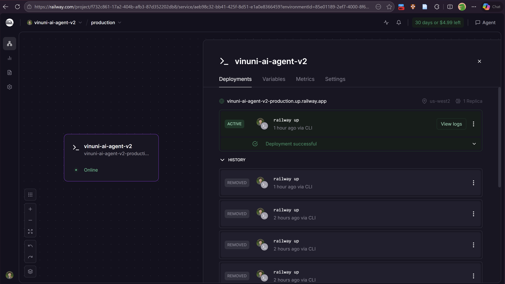
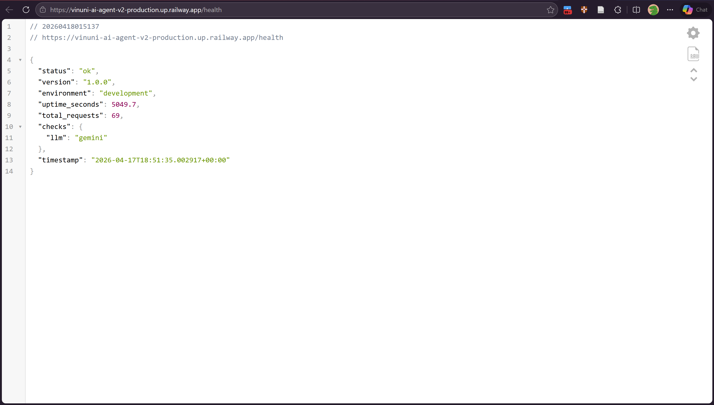
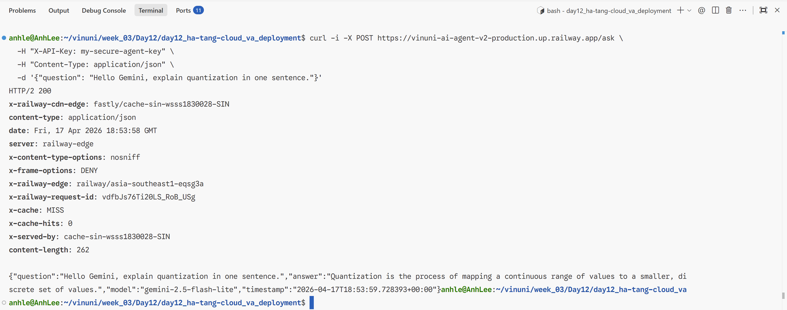

# Deployment Information

## Public URL
[https://vinuni-ai-agent-v2-production.up.railway.app](https://vinuni-ai-agent-v2-production.up.railway.app)

## Platform
Railway

## Test Commands

### 1. Health Check (Public)
```bash
curl -i https://vinuni-ai-agent-v2-production.up.railway.app/health
# Expected: 200 OK, {"status": "ok", ...}
```

### 2. Authentication Check (Should Fail 401)
```bash
curl -i https://vinuni-ai-agent-v2-production.up.railway.app/ask \
  -H "Content-Type: application/json" \
  -d '{"question": "Who are you?"}'
# Expected: 401 Unauthorized
```

### 3. API Test (With Authentication)
```bash
curl -i -X POST https://vinuni-ai-agent-v2-production.up.railway.app/ask \
  -H "X-API-Key: my-secure-agent-key" \
  -H "Content-Type: application/json" \
  -d '{"question": "Hello Gemini, explain quantization in one sentence."}'
# Expected: 200 OK + AI Response
```

## Environment Variables Set
| Variable | Description |
| :--- | :--- |
| `PORT` | 8000 |
| `AGENT_API_KEY` | Secured (Used in X-API-Key header) |
| `GEMINI_API_KEY` | Secured |
| `LLM_MODEL` | `gemini-2.0-flash` |
| `FALLBACK_MODELS` | Configured for high availability |

## Screenshots 
1. `screenshots/dashboard.png`

2. `screenshots/running.png`

3. `screenshots/test_results.png`

