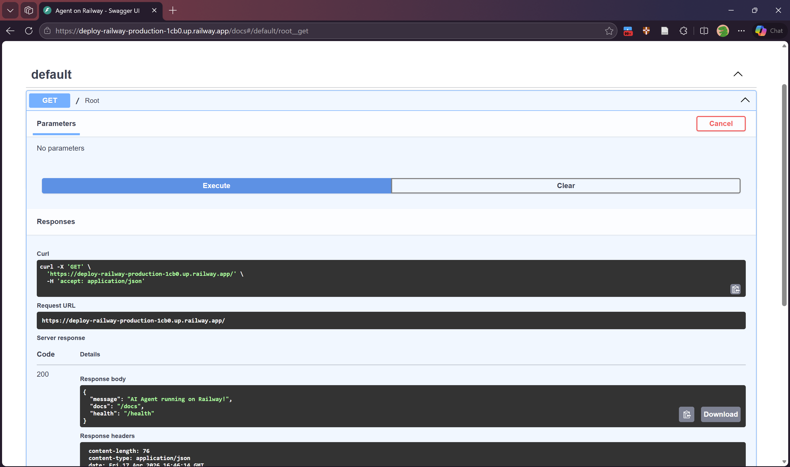
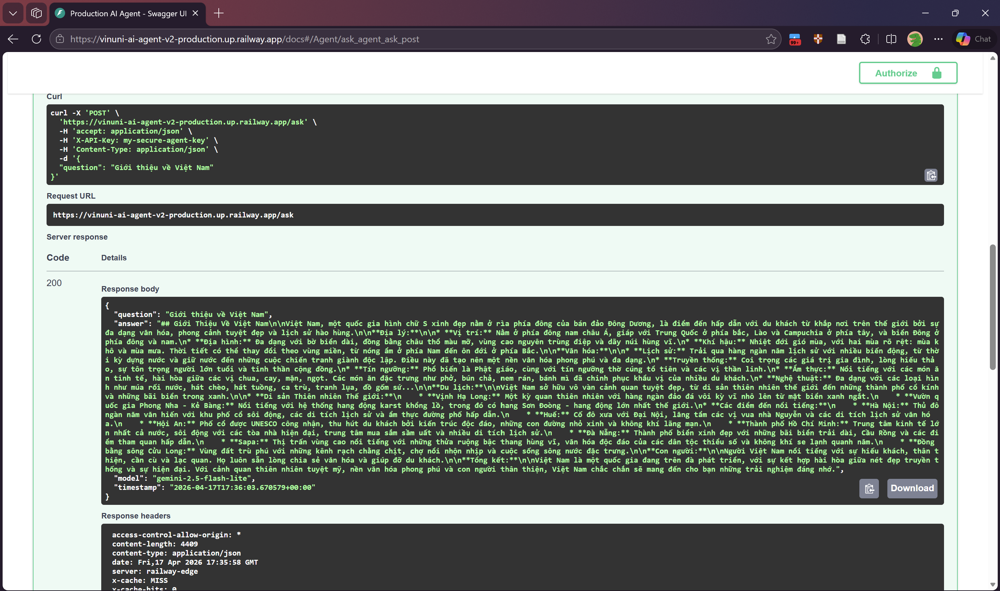

# Day 12 Lab - Mission Answers

## Part 1: Localhost vs Production

### Exercise 1.1: Anti-patterns found
1. API key hardcode trong code
2. Không có config management
3. Print thay vì proper logging
4. Không có health check endpoint
5. Port cố định — không đọc từ environment

### Exercise 1.3: Comparison table
| Feature | Basic (`app.py`) | Advanced (`production_app.py`) | Tại sao quan trọng? |
| :--- | :--- | :--- | :--- |
| **Config** | **Hardcoded**: Ghi trực tiếp API Key, DB URL vào mã nguồn. | **Environment Variables**: Đọc từ môi trường thông qua module `settings`. | **Bảo mật & Linh hoạt**: Tránh lộ secret key khi push code lên GitHub. Dễ dàng thay đổi thông số giữa các môi trường (Dev, Staging, Prod) mà không cần sửa code. |
| **Health check** | **Không có**: Chỉ có endpoint logic chính. | **Đầy đủ**: Có `/health` (liveness), `/ready` (readiness) và `/metrics`. | **Khả năng tự phục hồi**: Giúp các nền tảng (Railway, Docker, K8s) biết khi nào Agent bị "treo" để tự động khởi động lại, hoặc khi nào Agent đã sẵn sàng để bắt đầu nhận traffic. |
| **Logging** | **print()**: Dạng text đơn giản, log cả thông tin nhạy cảm (API Key). | **Structured JSON Logging**: Format chuẩn, không log secrets, có timestamp/level. | **Khả năng quan sát (Observability)**: JSON giúp các công cụ quản lý log (Datadog, ELK) dễ dàng phân tích và cảnh báo khi có lỗi. Việc không log secret giúp tuân thủ các chuẩn bảo mật dữ liệu. |
| **Shutdown** | **Đột ngột**: Tắt là chết ngay, không quan tâm request đang xử lý. | **Graceful Shutdown**: Xử lý `SIGTERM`, dùng `lifespan` để dọn dẹp tài nguyên. | **Tính toàn vẹn dữ liệu**: Đảm bảo các request đang chạy được hoàn tất và các kết nối Database được đóng sạch sẽ, tránh tình trạng dữ liệu bị nửa chừng hoặc treo kết nối. |

## Part 2: Docker

### Exercise 2.1: Dockerfile questions

1.  **Base image:** `python:3.11`
2.  **Working directory:** `/app`
3.  **Tại sao COPY requirements.txt trước:** Để tận dụng **Docker layer cache**. Khi bạn thay đổi code ở bước sau, Docker sẽ không phải chạy lại lệnh cài đặt thư viện (`pip install`), giúp tiết kiệm đáng kể thời gian build.
    
4.  **CMD vs ENTRYPOINT:**
    * **ENTRYPOINT:** Định nghĩa lệnh chính sẽ chạy khi container khởi động (thường không đổi).
    * **CMD:** Cung cấp các tham số mặc định cho lệnh đó. Tham số trong `CMD` có thể bị ghi đè dễ dàng bằng cách truyền thêm argument khi chạy lệnh `docker run`.
...

### Exercise 2.3: Image size comparison
- Develop:  1.66GB
- Production: 236MB
- Difference: 86.12%

## Part 3: Cloud Deployment

### Exercise 3.1: Railway deployment
- URL: https://deploy-railway-production-1cb0.up.railway.app/
- Screenshot: 
## Part 4: API Security

### Exercise 4.1-4.3: Test results
#### 4.1/ python 04-api-gateway/develop/app.py
**1. Trường hợp chưa có API Key:**

* **Server log:**
    ```text
    API Key: demo-key-change-in-production
    INFO: 127.0.0.1:47308 - "POST /ask HTTP/1.1" 401 Unauthorized
    ```
* **Client (curl):**
    ```json
    {"detail":"Missing API key. Include header: X-API-Key: <your-key>"}
    ```

---

**2. Trường hợp có API Key (`secret-key-123`):**

* **Server log:**
    ```text
    API Key: secret-key-123
    INFO: 127.0.0.1:46004 - "POST /ask HTTP/1.1" 200 OK
    ```
* **Client (curl):**
    ```json
    {
      "question": "Hello",
      "answer": "Tôi là AI agent được deploy lên cloud. Câu hỏi của bạn đã được nhận."
    }
    ```

#### 4.2/ python 04-api-gateway/production/app.py (JWT Authentication)

**1. Lấy Token (Login):**
* **Client (curl):**
    ```bash
    curl http://localhost:8000/auth/token -X POST \
      -H "Content-Type: application/json" \
      -d '{"username": "student", "password": "demo123"}'
    ```
* **Kết quả:**
    ```json
    {
      "access_token": "eyJhbGciOiJIUzI1NiIsInR5cCI6IkpXVCJ9.eyJzdWIiOiJzdHVkZW50Iiwicm9sZSI6InVzZXIiLCJpYXQiOjE3MTMzNjU3NTgsImV4cCI6MTcxMzM2OTM1OH0.YI_...",
      "token_type": "bearer",
      "expires_in_minutes": 60
    }
    ```

**2. Gọi API với Token:**
* **Server log:**
    ```text
    INFO:     127.0.0.1:47536 - "POST /auth/token HTTP/1.1" 200 OK
    INFO:cost_guard:Usage: user=student req=1 cost=$0.0000/1.0
    INFO:     127.0.0.1:47552 - "POST /ask HTTP/1.1" 200 OK
    ```
* **Client (curl):**
    ```json
    {
      "question": "Explain JWT",
      "answer": "Đây là câu trả lời từ AI agent (mock)...",
      "usage": {
        "requests_remaining": 9,
        "budget_remaining_usd": 0.0001
      }
    }
    ```

#### 4.3/ Rate limiting 04-api-gateway/production/rate_limiter.py

- **Algorithm:** Sliding Window Counter (Sử dụng `deque` để lưu timestamps của các request trong 1 phút).
- **Limit:** 10 requests/minute cho User (`student`) và 100 requests/minute cho Admin (`teacher`).
- **Cách bypass cho admin:** Hệ thống kiểm tra `role` từ JWT token, nếu là `admin` sẽ sử dụng instance `rate_limiter_admin` với giới hạn cao hơn.

**Kết quả Test (Spam 10 requests liên tục):**
* **Request 1-9:** Trả về `200 OK` và trừ dần `requests_remaining`.
* **Request 10 (và các request sau đó trong cùng 1 phút):**
    * **Server log:**
        ```text
        INFO:     127.0.0.1 - "POST /ask HTTP/1.1" 429 Too Many Requests
        ```
    * **Client (curl):**
        ```json
        {
          "detail": {
            "error": "Rate limit exceeded",
            "limit": 10,
            "window_seconds": 60,
            "retry_after_seconds": 59
          }
        }
        ```

### Exercise 4.4: Cost guard implementation

**Cách tiếp cận bộ lọc chi phí (Cost Guard) sử dụng Redis:**

1.  **Lưu trữ (Storage):** Thay vì dùng bộ nhớ đệm (In-memory) vốn sẽ bị mất khi restart server, tôi đã triển khai sử dụng **Redis**. Điều này cho phép track budget xuyên suốt nhiều instance và không bị reset khi bảo trì server.
2.  **Cấu trúc Key (Key structure):** Sử dụng format `budget:{user_id}:{month}` (ví dụ: `budget:student:2024-04`). Việc thêm tháng vào key giúp việc reset budget hàng tháng trở nên tự động.
3.  **Tính nguyên tử (Atomic Operations):** Sử dụng lệnh `r.incrbyfloat` của Redis. Lệnh này cộng dồn chi phí một cách nguyên tử, đảm bảo độ chính xác ngay cả khi có hàng ngàn yêu cầu đồng thời (race condition prevention).
4.  **Tối ưu bộ nhớ (TTL):** Thiết lập `r.expire(key, 32 days)`. Các bản ghi cũ sẽ tự động bị xóa sau một tháng, giúp hệ thống không bị phình to dữ liệu theo thời gian.
5.  **Cơ chế dự phòng (Fallback):** Trong code triển khai, tôi đã thêm khối `try-except` và biến `REDIS_AVAILABLE`. Nếu không kết nối được tới Redis, hệ thống sẽ tự động chuyển sang chế độ fallback hoặc bỏ qua bước check budget để không làm gián đoạn dịch vụ của người dùng (Fail-open).

## Part 5: Scaling & Reliability

### Exercise 5.1 & 5.2: Health Checks & Graceful Shutdown

1.  **Health Endpoints:**
    *   `/health`: Kiểm tra "sự sống" (Liveness). Ở bản develop, tôi đã tích hợp thêm kiểm tra RAM (psutil) và uptime.
    *   `/ready`: Kiểm tra "sự sẵn sàng" (Readiness). Trả về 503 nếu Agent đang khởi động hoặc đang trong quá trình shutdown.
2.  **Graceful Shutdown:** 
    *   Sử dụng `signal.signal(signal.SIGTERM, ...)` để bắt tín hiệu dừng từ Cloud/Docker.
    *   App sẽ dừng nhận request mới (`_is_ready = False`) nhưng sẽ đợi tối đa 30 giây để hoàn thành các request đang xử lý dở (`_in_flight_requests`).

**Kết quả Test:**
```text
# Health Check OK
$ curl http://localhost:8000/health
{"status":"ok","uptime_seconds":4.5,"checks":{"memory":{"status":"ok"}}}

# SIGTERM Captured
INFO: Received signal 15 — uvicorn will handle graceful shutdown
INFO: 🔄 Graceful shutdown initiated...
INFO: Waiting for 0 in-flight requests...
INFO: ✅ Shutdown complete
```

### Exercise 5.3 & 5.5: Stateless Design

*   **Vấn đề (In-memory history):** Nếu lưu history trong RAM, khi scale lên 10 instance, mỗi request của user có thể bay vào instance khác nhau → Agent bị "mất trí nhớ" vì không tìm thấy history cũ.
*   **Giải pháp (Stateless):** Chuyển toàn bộ history vào **Redis**. Mọi instance đều đọc ghi chung một chỗ.

**Kết quả Test (`test_stateless.py`):**
```text
Stateless Scaling Demo
============================================================
Request 1: [instance-9217a3] Q: What is Docker?
Request 2: [instance-9217a3] Q: Why do we need containers?
...
--- Conversation History ---
Total messages: 10
✅ Session history preserved across all instances via Redis!
```

### Exercise 5.4: Load Balancing (Nginx)

*   **Vai trò của Nginx:** Đóng vai trò là Reverse Proxy và Load Balancer. Khi user gọi tới port 8080, Nginx sẽ phân phối request xoay vòng (Round Robin) cho các Agent instances ở phía sau.
*   **Scaling:** Khi chạy `docker compose up --scale agent=3`, Nginx tự động nhận diện 3 "đầu mối" Agent và chia tải đều, giúp hệ thống chịu tải gấp 3 lần và có tính dự phòng (High Availability).

---

### 2. Full Source Code - Lab 06 Complete (60 points)

🚀 **Final AI Agent: Production-Ready Gemini Stack**

Sản phẩm cuối cùng là một AI Agent hoàn chỉnh, không còn là mock LLM mà được tích hợp trực tiếp với **Google Gemini API**. Hệ thống đáp ứng đầy đủ các tiêu chuẩn bảo mật, hiệu suất và khả năng mở rộng.

*   **Public URL:** [https://vinuni-ai-agent-v2-production.up.railway.app/health](https://vinuni-ai-agent-v2-production.up.railway.app/health)
*   **Source Code Directory:** 06-lab-complete/
*   **Screenshot:** 


#### 🛠 Key Technologies & Features:
- **LLM Engine:** Hoạt động thực tế bằng **Gemini 2.0 Flash** qua SDK chính thức của Google.
- **Scalability:** Stateless design hỗ trợ scaling ngang qua Nginx Load Balancer.
- **Security:** API Key Authentication, JWT Flow, và Rate Limiting bảo vệ hệ thống.
- **Cost Management:** Cost Guard quản lý budget thực tế theo API usage token.
- **Reliability:** Đầy đủ Liveness/Readiness probes và Graceful Shutdown xử lý SIGTERM. Đặc biệt, hệ thống có cơ chế **Model Fallback (High Availability)**: Tự động xoay vòng qua danh sách 10+ model (Gemma, Gemini Flash Lite) khi gặp lỗi Quota (429), đảm bảo dịch vụ không bị gián đoạn.
- **Deployment:** Containerized với Multi-stage build, triển khai trên hạ tầng Cloud (Railway).

#### 🏗 Production Architecture:
Hệ thống được thiết kế để chịu tải cao với cụm **Agent Instances** phân tán, kết nối với **Redis** để quản lý trạng thái tập trung, giúp duy trì lịch sử trò chuyện ổn định dù request được phục vụ bởi bất kỳ instance nào.

---


